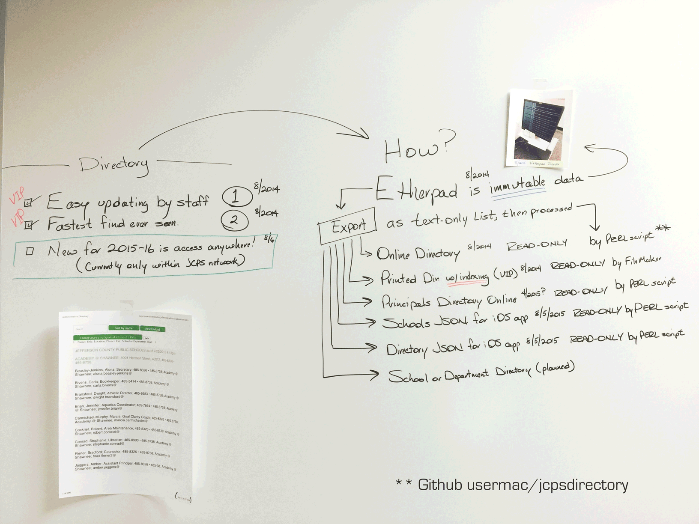

# jcpsdirectory
10/23/2015—Louisville, Kentucky. Process to move data from Etherpad to the JCPS live website http://www.jefferson.kyschools.us/phone/ . Immutable Data is in the Etherpad that any JCPS connected computer can edit. http://etherpad.jefferson.kyschools.us is a subdomain only reachable by a JCPS connected computer ( Intranet ) and a single source for the data. 

# Benefits

1. Easy Updateing by staff
2. Fastest find ever seen for end-user. 
3. Meta search. Try "Monday Memo"

# Live 
See it live and in-use here http://www.jefferson.kyschools.us/phone/

In the GIF below, the green button part is the end-user search page located at /phone. The rest is showing changes made to the Etherpad document. 

Credit should go to Jonny Strömberg for his listjs that makes the search so very fast on the web page.

# Mission
Allow quick search via online for public and staff of Jefferson County Public Schools. Secondarily is to provide a JSON feed for our vendor which produces our iOS app. Third, it allows a feed for our printed internal Administrative Directory ( with the help of another database. See Brian for details ).

# Workflow

From Ehterpad I export it as text-only. This results in a very long, 2,600 line text file with every administrative contact and department head and school. 

What results is a series of files. Some are manually inserted into a shell and others standalone and feed a new, this year, iOS app as JSON. 

# READ-ONLY output:

directory-admin.html contents copied into the index.html file for the Online Directory @ /Phone

Schools JSON for iOS app at /mpu/data/directory-schools.js 

People JSON for iOS app at /mpu/data/directory-people2.js 

There are 2 more files and they use the same Etherpad data but also work with relational files. They are for the printed directory and the online principals list. They need the relational data from the Red, White and Blue list. They are processed in FileMaker. - Brian

# Operation

Only PERL is needed for basic processing. It is the jcps-hallpass.pl file. The only other file needed is the directory-input.txt file which is the renamed export of the Etherpad export file. With just those 2 files, run the PERL script and it will make the other files. Upload the 2 javascript files into the /mpu/data/ folder on the website for the iOS app. The directory-admin.html, just copy its contents and replace the same in the index.html of the /Phone directory on the website. 

# History

This project began in-house 8/8/2014 by Brian Ginn, the new Systems Coordinator of Materials Production. Why? We needed a way to handle the data behind the printed directory mainly the index generation automatically. Until now, the index was done by hand. 

It was data provided by MIS that was imported into a FileMaker Pro 13 database and processed and even maintained there until 2015 when the core data was moved into an Etherpad text file. Yes, a plain text file is what drives our end-users to modify and update the directory instead of a formal database of any kind. 

That Etherpad list of about 2,300 administrative contacts has the core data such as name, phone, fax, location and department or school. Each line is compared to another database in FileMaker Pro on our server named DepartmentHeadings. The link creates the formal line listing of the physical location. 

— Brian
