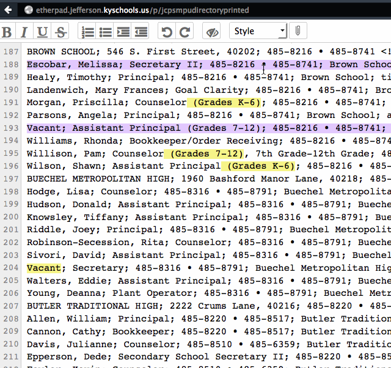

# jcpsdirectory
7/6/2015—Louisville, Kentucky. Process to move data from Etherpad to the website. - Brian
Immutable Data is in the Etherpad that any JCPS computer can edit. Etherpad is a subdomain only reachable by a JCPS connected computer and a single source for the data. 

In the animated gif above, you should see the colored text in an Etherpad document. That is where anyone within the Intranet has made an update or change. As the animation changes, you'll see the green buttons that tell you you're on the web page. Notice how fast the search is. This project documents how I move from Etherpad to live Web. 

Credit should go to Jonny Strömberg for his listjs that makes the search so very fast on the web page.

History

This project began in-house 8/8/2014 by Brian Ginn, the new Systems Coordinator of Materials Production. Why? We needed a way to handle the data behind the printed directory mainly the index generation automatically. Until now, the index was done by hand. 

It was data provided by MIS that was imported into a FileMaker Pro 13 database and processed and even maintained there until 2015 when the core data was moved into an Etherpad text file. Yes, a plain text file is what drives our end-users to modify and update the directory instead of a formal database of any kind. 

That Etherpad list of about 2,300 administrative contacts has the core data such as name, phone, fax, location and department or school. Each line is compared to another database in FileMaker Pro on our server named DepartmentHeadings. The link creates the formal line listing of the physical location. 

Workflow

From Ehterpad I export it as text-only. 
Currently I process the file in BBEdit using five RegEx's to put the data in order. Grep Patterns.xml is the file that belongs in the OSX > Library > Application Support > BBEdit > Setup. 

I then import the data into FileMaker Pro but in 2 parts:
Departments and Schools

The FileMaker Pro schools and departments databases export the file into Principal's lists and Directory list and another file for printed that has index coding. 

These three files and then put in place on the web, well, two of them are. The last one is directly imported into an Adobe InDesign CS6 template as regular pages with one major advantage: it has indexing coded behind each entry. The TOC is generated and placed or replaced as needed. Amazingly effective. 

Roadmap

Production: The future is to move away from proprietary software and into open source. 
Function: Create single line items for the purpose of creating business cards and stationary. 

Transition to PERL

7/7/2015 begins the transition. I am familiarizing myself now with PERL and it is fantastic at regular expression. Just what I need. It also comes native on OSX and easily added to Windows. The file jcps-hallpass.pl is the test file. The text files directory-output.txt and directory-input.txt and directory-log.txt are all in place. More later on these but for now they are testing files. 

As of now I've learned how to create a script, set it up for error checking. I've learned how to stag a file for processing. Now I'll learn how to save the file rather, the line-by-line to the directory-output.txt file which will be the file used for data to be read from the Web page.

— Brian
